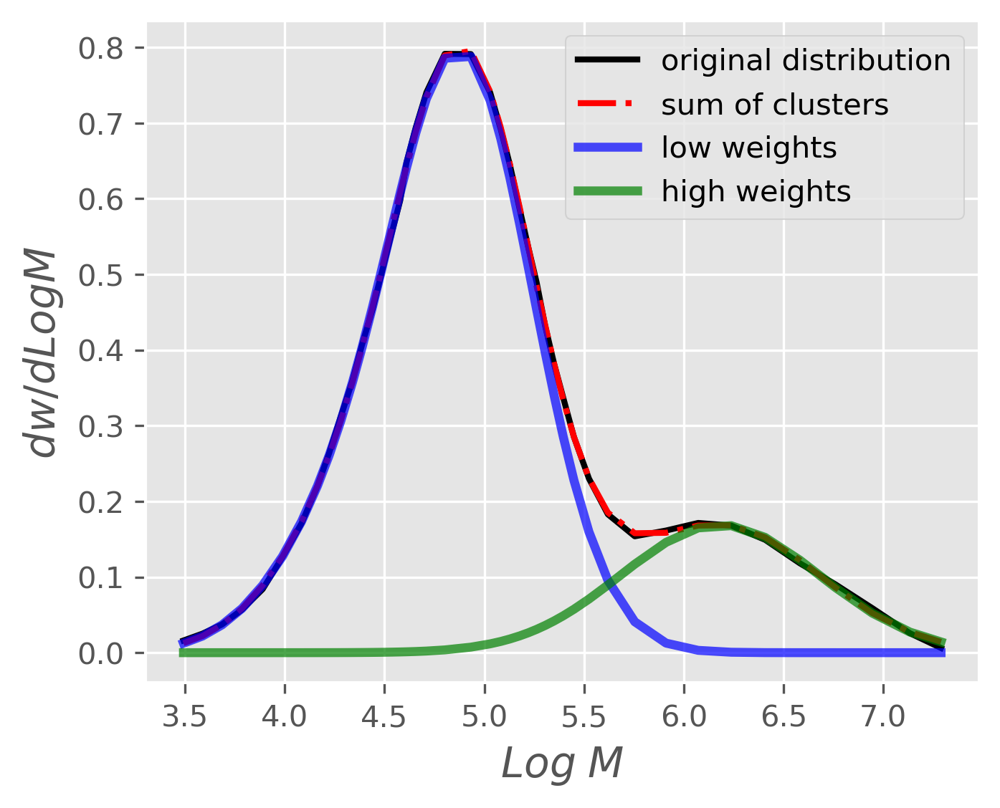

# Classification of polymer chain based on their production sites
---

Image source: https://augustrs.com/wp-content/uploads/2020/02/Polymer-Chain_1.jpg

In this project Machine learning techniques would be employed to segment polymer chains into their respective subpopulations given a molecular weight distribution.

### Table of Contents
- [**Introduction**](#introduction)
- [**Project structure**](#project-structure)
- [**Dataset**](#dataset)
- [**Key insight**](#key-insights)
- [**Tools used in this project**](#tools-used-in-this-project)

## Introduction
---
>A classification algorithm was used to segment polymer chains into the production site they might have originated from. The motivation of this project is to identify the various clusters in a molecular weight distribution of polymer chains and use such information to perform peak deconvolutions. Traditionally peak deconvolution is done using commercial software which require the user to be able to manually indicate the peak locations prior to the deconvolution. But with the production by day of more complex materials a distribution that may seem to have two cluster could actually contain more which are invisible to the eye. This program uses machine learning to identify all clusters and subsequently performs a peak deconvolution.

### Project structure

* the folder 'reports' contains:
    * the executive summary
    * notes on data preprocessing
* all codes can be found in the folder 'src'

## Dataset
---
The dataset was digitized from a paper published by [*kwakye-Nimo et al.(2022)*](https://link.springer.com/article/10.1007/s00397-022-01340-5)

## Key insights
---
The subpopulations in a molecular weight distribution can be identified using Machine learning. With knowledge of the sub-population characteristics an optimization routine can be subsequently used to effectively perform peak deconvolution. This method eliminates the need for the user to know ahead of time the characteristics of the peaks he is seeking to identify.

## Tools used in this project
---
* Packages: Anaconda
* Libraries: Pandas, Numpy, Scipy, Matplotlib, Seaborn
* Web applications: Jupyter notebook
* Programming languages: Python 3, LaTeX

